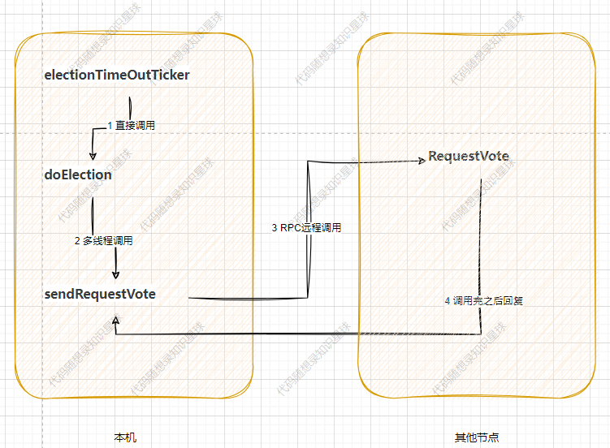
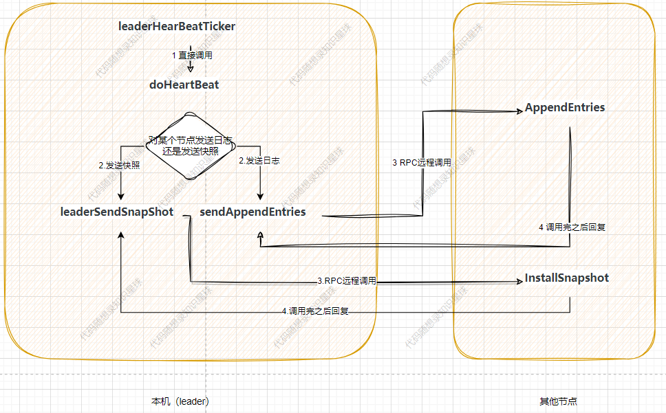

kv-raft

## 选举

## 日志复制/心跳

## snapshot快照

## 对 m_nextIndex 和 m_matchIndex作用的补充：

m_nextIndex 保存leader下一次应该从哪一个日志开始发送给follower；m_matchIndex表示follower在哪一个日志是已经匹配了的（由于日志安全性，某一个日志匹配，那么这个日志及其之前的日志都是匹配的）

一个比较容易弄错的问题是：m_nextIndex 与m_matchIndex 是否有冗余，即使用一个m_nextIndex 可以吗？

显然是不行的，m_nextIndex 的作用是用来寻找m_matchIndex ，不能直接取代。我们可以从这两个变量的变化看，在当选leader后，m_nextIndex 初始化为最新日志index，m_matchIndex 初始化为0，如果日志不匹配，那么m_nextIndex 就会不断的缩减，直到遇到匹配的日志，这时候m_nextIndex 应该一直为m_matchIndex+1 。

如果一直不发生故障，那么后期m_nextIndex就没有太大作用了，但是raft考虑需要考虑故障的情况，因此需要使用两个变量。

## 可以尝试思考的问题

- 锁，能否在其中的某个地方提前放锁，或者使用多把锁来尝试提升性能？ 
- 多线程发送，能不能直接在doHeartBeat或者doElection函数里面直接一个一个发送消息呢？